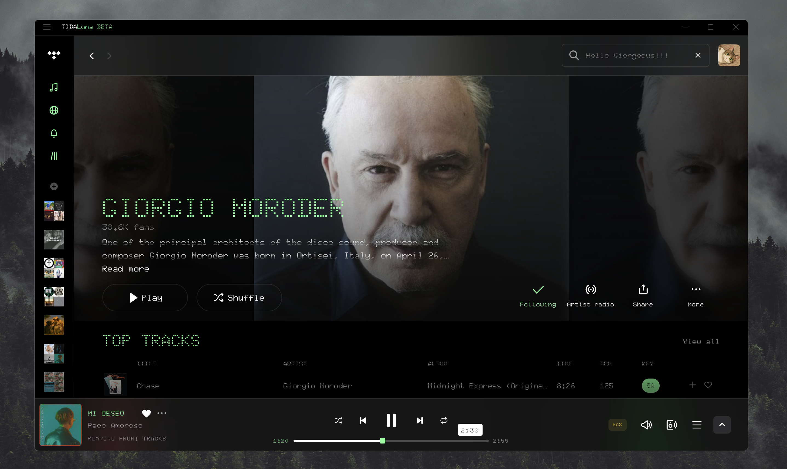
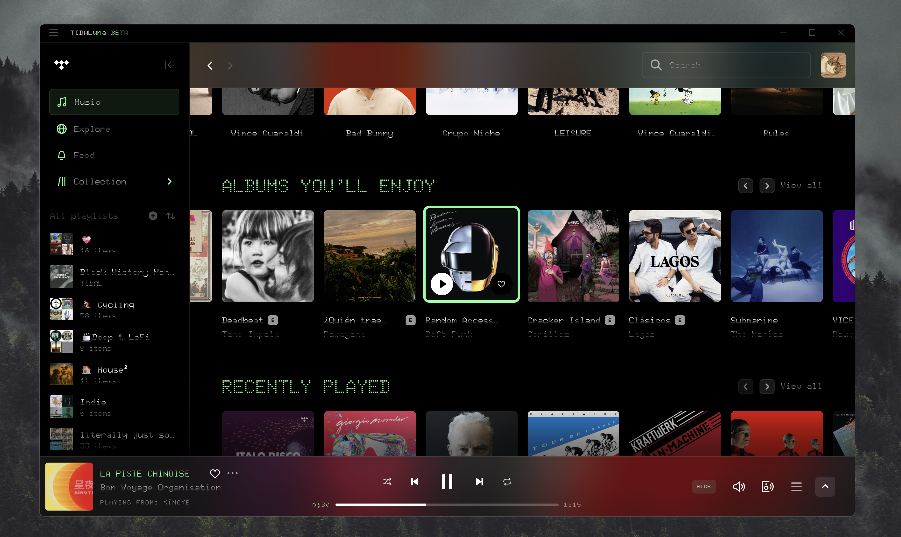
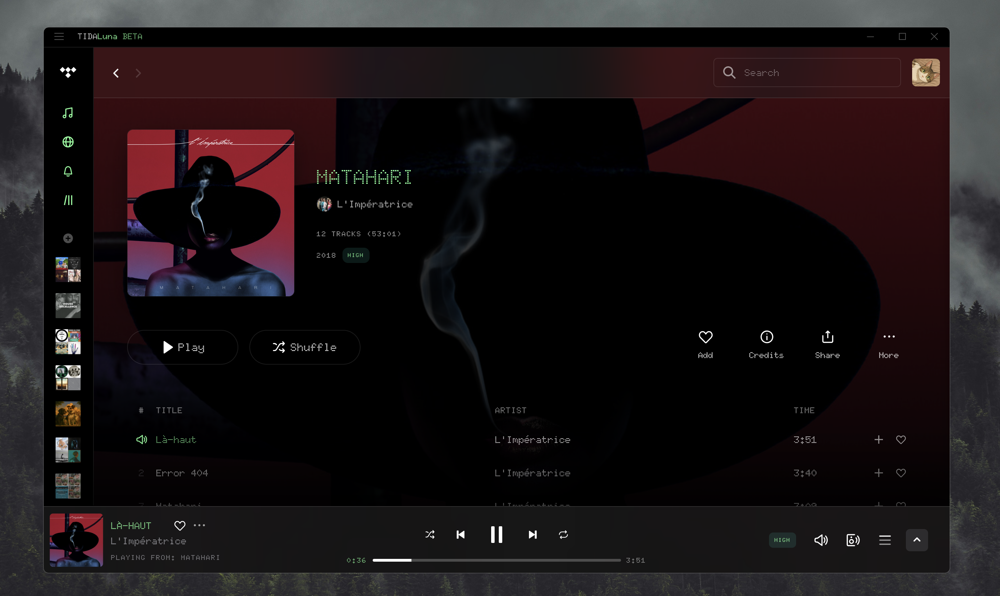
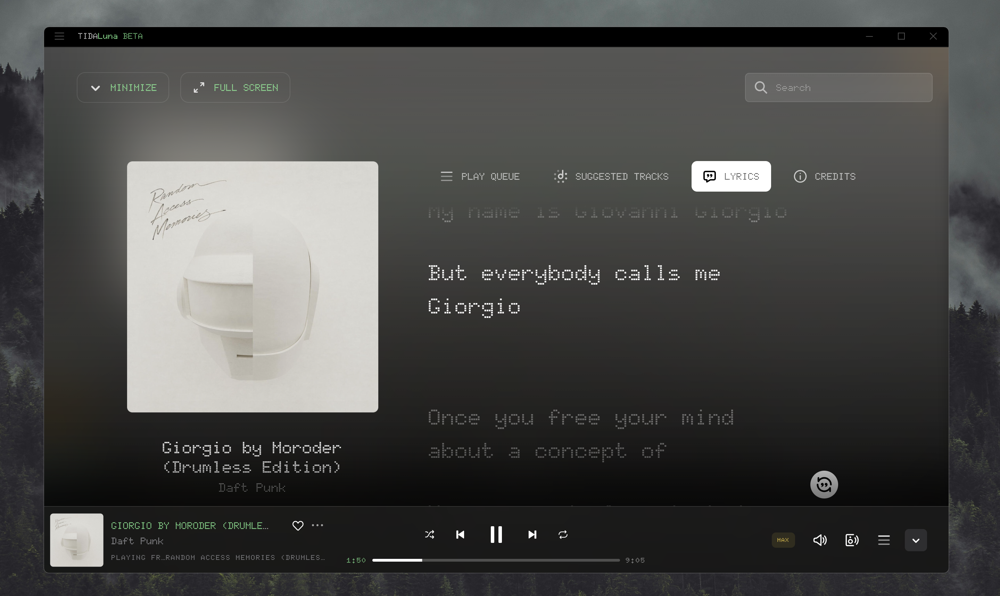

# Giorgeous
A nostalgic electronic theme for Tidal.






---

## 🛠️ Desktop Installation (With Tidaluna)

> [!IMPORTANT]
> To make it look like the previews, please download and install this font first: [**Doto**](https://fonts.google.com/specimen/Doto)

1.  **Install Luna Client Mod:** Run the installer. If you don't have it:
    * [**Download Luna Installer**](https://github.com/Inrixia/TidaLuna)
2.  **Open Luna Settings:** In Tidal, click the **three-dot menu** next to your profile icon and select **Luna settings**.
3.  **Apply Theme:**
    * Go to the **Themes** tab in Luna Settings.
    * Click on **Add Theme**.
    * Paste the following **Raw URL**:
    ```text
    [https://raw.githubusercontent.com/Acercandr0/Giorgeous/main/Giorgeous.css](https://raw.githubusercontent.com/Acercandr0/Giorgeous/main/Giorgeous.css)
    ```
4.  **Auto-Updates:** This method keeps your theme updated! Tidaluna will automatically fetch changes from the repository.

---

## 🧉 Made with cariño by [@Acercandr0](https://github.com/Acercandr0)
Enjoy it. Fork it. Remix it. Make it yours.